# Datamart validation — retrieval & generation

> **Architecture & eval:** prefer [`PIPELINE.md`](PIPELINE.md) and `pipeline/README.md` for the
> S1–S6 link → resolve → verify → respond pipeline. This file is a legacy module index.

This document describes **how context retrieval and SQL generation are validated** in mint-analytics v1.5, and how users see evidence before trusting an answer.

It applies to workspace datamart chat (`chat_pipeline.py`), template modification (`template_pipeline.py`), and shared modules (`schema_broker.py`, `semantic_layer.py`, `validation_runner.py`).

---

## Overview

The agent runs in two main phases before the user sees a result:

| Phase | Purpose |
|-------|---------|
| **1. Retrieval** | Build grounded schema context (tables, columns, joins, semantic mappings) for the LLM |
| **2. Generation** | LLM produces SQL; server validates, executes, and returns rows + narrative |

Validation is split the same way: **validate context first**, then **validate SQL against the question and that context**.

> **Important:** This approach improves safety and transparency. It does **not** guarantee 100% correct answers for every natural-language question. See [What we do not guarantee](#what-we-do-not-guarantee).

---

## End-to-end flow (implemented)

```mermaid
flowchart LR
  Q[User question]
  R[Retrieve context + relevance filter]
  VA[Validate retrieval]
  UC[Optional user confirm tables]
  MT[Optional verified_sql metric]
  L[LLM generates SQL]
  VB[Faithfulness + optional critic]
  B[Binding + syntax]
  E[Execute SQL]
  U[Badge + panel + persist JSONB]

  Q --> R --> VA
  VA -->|enforce optional| UC
  UC --> MT
  MT --> L
  L --> VB --> B --> E --> U
```



### Recommended pathway (chat, one turn)

| Rule | Implementation |
|------|----------------|
| Fail closed on bad retrieval | `DATAMART_VALIDATION_BLOCK_INSUFFICIENT_EXEC=true` stops before LLM/execute |
| No verified metric on reports | `metric_templates.py` + `DATAMART_VALIDATION_VERIFIED_METRICS=false` |
| SQL must match question | `sql_answer_adequacy.py` before `execute_sql()` |
| Columns scoped per table | `sql_binding.py` + `sql_column_allowlist.py` + pre-execute gate in `schema.execute_sql()` |
| LLM schema packet (per-table blocks) | `grounded_schema_prompt.py` via `SchemaGrounding.to_prompt_text()` |
| At most one LLM repair | `RepairBudget` + `DATAMART_MAX_REPAIR_ATTEMPTS_PER_TURN=1` (`pipeline_retry.py`) |
| UI shows steps | `pipeline_trace.py` → `DatamartResponse.pipeline_trace` → `DatamartPipelineSteps` |

Trace steps (in order): schema grounding → retrieval check → generate SQL → validate SQL (binding) → repair (if used) → **Check report output columns** → execute query. The adequacy step no longer re-runs ReportSpec/domain/catalog-link checks; on mismatch it stores the first SQL, regenerates once (catalog first, then one LLM repair if needed), scores both, and runs the better script.

---

## Part 1 — Retrieval (context)

| Step | Implementation |
|------|----------------|
| Match question to catalog | `resolve_semantics()` + `build_schema_links()` |
| Search metadata | `search_relevant_tables()` (DataHub, tenant-scoped) |
| Pick tables | `build_schema_grounding()`; optional `apply_retrieval_relevance_filter()` |
| Load columns | `introspect_table_columns()` + join hints |
| Check before LLM | `validate_retrieval()` → `sufficient` / `ambiguous` / `insufficient` |
| User visibility | `DatamartValidationPanel` (tables, topics, metrics, warnings) |
| Confirm sources | `POST /datamart/grounding/preview` + `confirmed_tables` on chat; UI: `DatamartGroundingConfirm` when `REACT_APP_DATAMART_GROUNDING_CONFIRM=true` |

### Key code

| Component | File |
|-----------|------|
| Retrieval validation | `retrieval_validator.py` |
| Relevance filter | `retrieval_relevance.py` |
| Schema linker | `schema_linker.py` |
| Orchestration | `validation_runner.py` |
| Offline eval | `backend/tools/run_datamart_eval.py` (golden ReportSpec SQL + broker retrieval) |
| Question bank (50 prompts) | `backend/tools/datamart_question_bank.yaml` — manual QA; optional `run_question_bank_eval.py` (live broker, slow) |
| Question bank CI | `tests/datamart/test_question_bank_catalog_ci.py` — catalog templates with mocked grounding (fast) |
| ReportSpec gates | `report_spec.py`, `report_sql_router.py`, `report_spec_validate.py`, `refinement_guard.py` |
| Grounded catalog SQL | `leave_report_sql.py`, `payroll_report_sql.py`, `catalog_report_sql.py` via `report_sql_router.py` |

---

## Part 2 — Generation (SQL)

| Step | Implementation |
|------|----------------|
| LLM writes SQL | `call_llm()` → narrative + SQL (+ post-process / extra blocks) |
| Allowlist check | `validate_sql_with_grounding()` → `validate_sql_bindings()`; optional strict multi-table aliases |
| Report output columns | `sql_answer_adequacy.py` (fast SELECT column match only) |
| Adequacy regen + pick best | `adequacy_resolve.py` (one catalog/LLM regen, compare two SQL scripts) |
| Logic vs question | `sql_faithfulness.py` (LIMIT, ORDER BY, joins, schema links) |
| Second opinion | Optional `sql_generation_critic.py` when `DATAMART_VALIDATION_CRITIC=true` |
| Syntax | `validate_sql_syntax()` |
| Run query | `execute_sql()` + repairs |
| User sees result | `DatamartValidationBadge` + warnings; extra blocks get per-block validation |

### Tier-A metrics (verified SQL)

Catalog metrics may define `verified_sql` with `{limit}` and `{schema}` placeholders. When `DATAMART_VALIDATION_VERIFIED_METRICS=true` (default), `metric_templates.try_resolve_verified_metric_sql()` can skip the LLM **only** for simple scalar questions (e.g. “What is headcount?”, “Show top 10 by salary”) with **sufficient** retrieval.

Verified SQL is **not** used when:

- Retrieval is `insufficient` or ambiguous with missing tables
- The question asks for a **report**, **combine**, **include** multiple fields, or lists several columns

If SQL is only `COUNT(*)` but the question needs a multi-column report, execution is blocked with a clear error (before hitting the warehouse).

### Key code

| Component | File |
|-----------|------|
| Chat pipeline | `chat_pipeline.py` |
| Template pipeline | `template_pipeline.py` |
| Shared finish helper | `pipeline_validation.finish_validated_response()` |
| Binding | `sql_binding.py`, `pipeline_common.py` |
| Trust score | `trust_scorer.py` |

---

## Trust levels (UI)

| Badge | Meaning |
|-------|---------|
| **Verified** | Retrieval sufficient; binding OK; no major faithfulness warnings |
| **Plausible** | Ran successfully; minor warnings |
| **Needs review** | Weak retrieval, SQL warnings, truncation, or grounding expanded |
| **Blocked** | No schema, insufficient retrieval (if enforced), or binding failed |

---

## Configuration (environment)

| Variable | Default | Purpose |
|----------|---------|---------|
| `DATAMART_VALIDATION_ENABLED` | `true` | Master switch |
| `DATAMART_VALIDATION_FAITHFULNESS` | `true` | LIMIT/join/link checks |
| `DATAMART_VALIDATION_ENFORCE_RETRIEVAL` | `false` | Block LLM when retrieval `insufficient` |
| `DATAMART_VALIDATION_RELEVANCE_FILTER` | `true` | Trim low-relevance tables before validation |
| `DATAMART_VALIDATION_STRICT_BINDING` | `false` | Require table aliases when 2+ tables in scope |
| `DATAMART_VALIDATION_CRITIC` | `false` | LLM SQL critic pass (extra latency) |
| `DATAMART_VALIDATION_VERIFIED_METRICS` | `false` | Use catalog `verified_sql` only for simple scalar questions |
| `DATAMART_VALIDATION_BLOCK_INSUFFICIENT_EXEC` | `true` | Do not run SQL when retrieval is insufficient |
| `DATAMART_VALIDATION_REQUIRE_ADEQUACY` | `true` | Block execute when SQL does not match the question |
| `DATAMART_MAX_REPAIR_ATTEMPTS_PER_TURN` | `1` | Shared repair budget (binding, adequacy, exec) |
| `REACT_APP_DATAMART_GROUNDING_CONFIRM` | `false` | Confirm-sources modal before new questions |

**Suggested local dogfood** (see `backend/.env.example` and `frontend/.env.example`):

```env
DATAMART_VALIDATION_ENFORCE_RETRIEVAL=false
DATAMART_VALIDATION_CRITIC=false
REACT_APP_DATAMART_GROUNDING_CONFIRM=true
```

---

## API shape

`DatamartResponse.validation` (and persisted `datamart_chat_messages.validation` JSONB):

```json
{
  "retrieval": {
    "status": "sufficient",
    "tables_selected": ["dim_employee", "fact_payroll_detail"],
    "schema_links": [
      { "term": "basic salary", "qualified_column": "hr.fact_payroll_detail.basic_salary", "confidence": "high", "source": "catalog_metric" }
    ],
    "warnings": []
  },
  "generation": {
    "binding": "passed",
    "warnings": ["LIMIT is 50; question asked for top 10"],
    "truncated": false,
    "grounding_expanded": false
  },
  "overall": "needs_review"
}
```

Endpoints:

- `POST /datamart/chat` — optional `confirmed_tables`
- `POST /datamart/grounding/preview` — retrieval preview without LLM
- `GET /datamart/sessions/{id}/messages` — includes `validation` on assistant turns

---

## Implementation status

| Priority | Work item | Status |
|----------|-----------|--------|
| P0 | Retrieval validator | **Done** |
| P0 | SQL faithfulness | **Done** |
| P0 | API + validation UI panel | **Done** |
| P1 | Enforce insufficient retrieval | **Done** (flag) |
| P1 | Grounding preview + confirm tables | **Done** (flag on UI) |
| P1 | Persist validation on messages | **Done** — migration `0010_dm_msg_validation` |
| P1 | Template pipeline validation on all exits | **Done** |
| P2 | Generation critic | **Done** (flag) |
| P3 | `verified_sql` metric templates | **Done** |
| — | Extra block validation + trust downgrade | **Done** |
| — | Offline eval + CI pytest | **Done** — `test_datamart_eval_ci.py` |
| — | Playwright validation badge | **Done** — `e2e/datamart-validation.spec.ts` (mocked API) |

### Not implemented (future)

| Item | Notes |
|------|--------|
| LLM **EVIDENCE** block in responses | Optional structured filters/grain in LLM output |
| Full warehouse ↔ catalog column diff job | Partial: drift warnings on low-confidence schema links |
| Binding inside `extra_blocks.py` alone | Extra blocks validated in chat/add-scenario after execution |

---

## What we do not guarantee

| Phase | What validation improves | What can still fail |
|-------|--------------------------|-------------------|
| **Retrieval** | Missing obvious tables; noise warnings | Ambiguous terms; synonyms not in catalog |
| **Generation** | Hallucinated columns; obvious LIMIT/order issues | Wrong grain, filters, joins |
| **Execution** | Read-only, runnable SQL | Runs but wrong business answer |
| **User confirm** | User catches wrong sources | Skipped when flag off |

---

## Related documentation

- [Semantic catalogs README](./semantic_catalogs/README.md)
- [DATAHUB_SETUP.md](../../../../../DATAHUB_SETUP.md) (repo root)
- Phase verify script: `scripts/verify_datamart_phases.ps1`
- Offline broker eval: `backend/tools/run_datamart_eval.py`

---

*Last updated: reflects implemented validation in mint-analytics-v1.5.*
