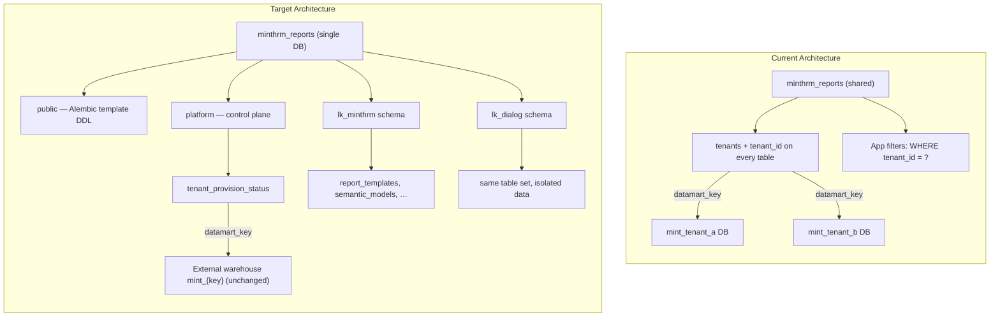
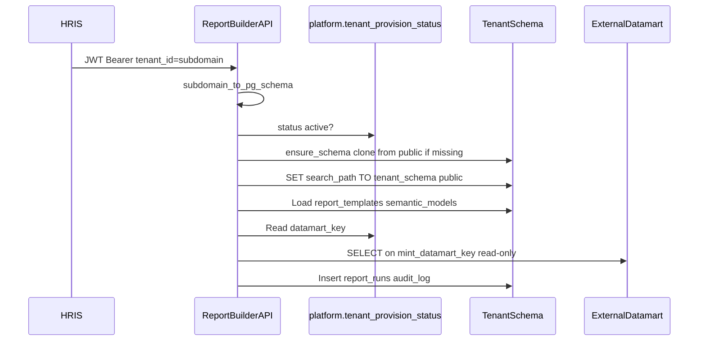
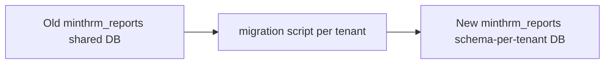
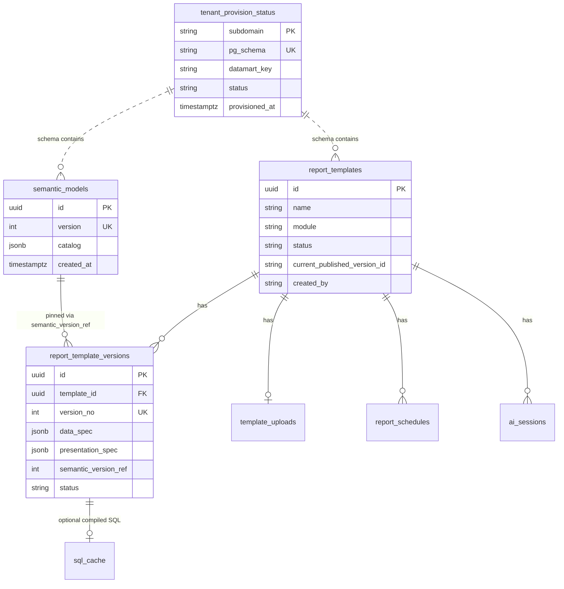

# Report Builder → Schema-Per-Tenant DB Architecture

**Status:** Plan (review before implementation)  
**Date:** August 2026  
**Reference:** Payroll-platform schema-per-tenant pattern (`Payroll-platform/backend`)

---

## Overview

Migrate Report Builder's metadata PostgreSQL from a shared database with row-level `tenant_id` isolation to the payroll-platform schema-per-tenant pattern:

- Dedicated DB (`minthrm_reports`)
- `public` as Alembic template
- `platform` for control-plane
- Per-customer schemas cloned from `public`
- Two-phase Alembic migrations

The external datamart warehouse (separate server, DB-per-tenant) stays **unchanged**.

---

## Decisions (confirmed)

| Decision | Choice |
|---|---|
| PostgreSQL placement | **Separate database** (`minthrm_reports`) — same pattern as payroll-platform, not co-located in `minthrm_payroll` |
| Datamart warehouse | **Unchanged** — external server, one physical DB per customer (`mint_{tenant_key}`) |
| Scope of this migration | **Metadata / app-owned PostgreSQL only** |

---

## Current vs target architecture



### What changes vs what stays

| Layer | Before | After |
|---|---|---|
| Metadata DB | 1 shared DB, `tenant_id` on ~20 tables | 1 DB, 1 schema per customer, **no `tenant_id` on tenant tables** |
| Tenant routing | JWT `tenant_id` → filter rows | JWT `tenant_id` → `subdomain_to_pg_schema()` → `SET search_path TO "{schema}", public` |
| Provisioning | Auto-insert `tenants` row on first JWT | Gated lazy clone from `public` (payroll-platform pattern) |
| Alembic | Single-phase, one `alembic_version` | Two-phase: `public` then each tenant schema |
| Datamart | DB-per-tenant on warehouse server | **No change** — `backend/app/db/datamart.py` keeps `mint_{tenant_key}` pattern |

---

## Target PostgreSQL layout

```mermaid
erDiagram
    subgraph platform_schema [platform schema - shared control plane]
        tenant_provision_status {
            string subdomain PK
            string pg_schema
            string datamart_key
            string status
            timestamp provisioned_at
            string provisioned_by
        }
        ai_provider_configs_system {
            string id PK
            string provider
            string model
            text api_key_encrypted
            bool enabled
        }
    end

    subgraph tenant_schema [tenant schema e.g. lk_minthrm - cloned from public]
        semantic_models {
            string id PK
            int version
            jsonb catalog
        }
        report_templates {
            string id PK
            string name
            string module
            string status
        }
        report_template_versions {
            string id PK
            string template_id FK
            int version_no
            jsonb data_spec
            jsonb presentation_spec
            int semantic_version_ref
            string status
        }
        report_schedules {
            string id PK
            string template_id FK
            string cron
            jsonb recipients
        }
        ai_sessions {
            string id PK
            string template_id
            jsonb messages
        }
        ai_provider_configs {
            string id PK
            string provider
            string model
        }
        audit_log {
            string id PK
            string user_id
            string action
            jsonb detail
        }
        report_runs {
            string id PK
            string report_id
            string compiled_sql_hash
            string datamart_snapshot_ref
        }
        semantic_metrics {
            string id PK
            string key
            jsonb definition
        }
        semantic_glossary {
            string id PK
            string term_key
            jsonb definition
        }
        learned_intent {
            string id PK
            string phrase_key
            jsonb spec
        }
        learned_column_mapping {
            string id PK
            string header_key
            string ref
        }
        field_request {
            string id PK
            string header_key
            string status
        }
        document_categories {
            string id PK
            string doc_type
            string name
        }
        letterheads {
            string id PK
            string name
        }
        manual_fields {
            string id PK
            string key
            string label
        }
        template_uploads {
            string template_id PK
            bytes content_enc
        }
        mart_validation_result {
            string id PK
            string validation_run_id
            string name
            string status
        }
        sql_cache {
            string version_id PK
            text sql_text
        }
    end

    report_templates ||--o{ report_template_versions : versions
    report_templates ||--o| template_uploads : source
    report_templates ||--o{ report_schedules : schedules
    report_templates ||--o{ ai_sessions : builds
    tenant_provision_status ||..|| tenant_schema : "pg_schema maps to schema name"
```

### Table placement rules

| Schema | Tables | Notes |
|---|---|---|
| **`public`** | All tenant-scoped tables (template DDL only) | Alembic Phase 1 target; clone source for new tenants |
| **`platform`** | `tenant_provision_status`, optional system-level `ai_provider_configs` | Cross-tenant; explicit `schema="platform"` in ORM |
| **`{tenant}`** | Same tables as `public`, **without `tenant_id` columns** | Data isolated by schema; session uses `search_path` |
| **Removed** | `tenants`, `users` | Replaced by `platform.tenant_provision_status` + HRIS JWT auth |

### Reference implementation to port (payroll-platform)

| Payroll-platform file | Purpose |
|---|---|
| `backend/app/db/pg_schema_provisioner.py` | Clone `public` → tenant schema |
| `backend/app/db/pg_tenant_session.py` | Tenant-scoped session manager |
| `backend/app/db/pg_tenant_db.py` | Schema discovery, FK replay, Alembic version seeding |
| `backend/alembic/env.py` | Two-phase multi-tenant Alembic runner |
| `backend/app/tenancy/pg_schema.py` | `subdomain_to_pg_schema()`, validation |

---

## End-to-end request flow (target)



---

## Implementation phases

### Phase 1 — Extract shared multi-tenant infrastructure

Copy/adapt payroll-platform modules into Report Builder under `backend/app/db/` and `backend/app/tenancy/`:

| New file | Source / purpose |
|---|---|
| `backend/app/db/postgres.py` | Shared engine, default `search_path=public` |
| `backend/app/db/pg_tenant_session.py` | `PostgresTenantSessionManager.scope(tenant_code)` |
| `backend/app/db/pg_schema_provisioner.py` | Clone `public` → tenant schema |
| `backend/app/db/pg_tenant_db.py` | `list_tenant_schemas()`, FK replay, alembic version seeding |
| `backend/app/db/pg_migrate.py` | Optional `PG_AUTO_MIGRATE` on startup |
| `backend/app/tenancy/pg_schema.py` | `subdomain_to_pg_schema()`, validation |
| `backend/app/tenancy/headers.py` | Optional `X-Tenant-Code` extraction (alongside JWT) |

Add config to `backend/app/core/config.py`:

```
METADATA_DB_URL → minthrm_reports (unchanged env name, new semantics)
PG_TEMPLATE_SCHEMA=public
PG_AUTO_MIGRATE=false
PG_ALLOW_UNREGISTERED_TENANTS=true   # dev only
PG_PROVISION_API_KEY=...             # internal onboarding route
```

### Phase 2 — Replace Alembic with two-phase runner

Replace `backend/migrations/env.py` with payroll-platform's two-phase pattern:

**Phase 1** — `SET search_path TO public, platform`:

- Create shared enum types in `public` (if any)
- Create all tenant-template tables in `public` (no `tenant_id`)
- Create `platform.tenant_provision_status` (+ optional system AI config)
- Track version in `public.alembic_version`

**Phase 2** — for each discovered tenant schema:

- `SET search_path TO "{schema}", public`
- Run pending revisions
- Track version in `public.alembic_version__{schema}`

**Migration baseline strategy:** Create a **new squashed initial revision** (`0017_schema_per_tenant_baseline` or replace chain on greenfield). Do not try to incrementally ALTER existing 0001–0016 in place — the tenancy model change is structural.

Key autogenerate filters (from payroll-platform):

- Include only `public`, `platform`, unqualified tables
- Exclude `alembic_version*` tables

Update `infra/docker-compose.yml`: metadata-db service stays; entrypoint runs `alembic upgrade head` before uvicorn (mirror payroll `docker-entrypoint.sh`).

### Phase 3 — Refactor ORM models

Refactor `backend/app/db/metadata.py`:

1. Rename base to `PostgresBase` (no hard-coded schema on tenant tables)
2. **Drop `tenant_id`** from all tenant-scoped models
3. **Drop `tenants` and `users` tables** (auth from HRIS JWT; provisioning via platform)
4. Add `platform`-schema models:
   - `TenantProvisionStatus` (`subdomain`, `pg_schema`, `datamart_key`, `status`)
   - System `AIProviderConfig` (replaces `__system__` sentinel row)
5. Unique constraints that were `(tenant_id, x)` become `(x)` only — safe because schema provides isolation

Example before/after for `report_templates`:

```python
# Before
tenant_id: Mapped[str] = mapped_column(ForeignKey("tenants.id"), index=True)

# After — no tenant_id; isolation via search_path
# (table lives in tenant schema, cloned from public template)
```

### Phase 4 — Session layer + FastAPI dependencies

Replace global `SessionLocal` / `get_db()` pattern:

| Current | Target |
|---|---|
| `backend/app/api/deps.py` `db_session()` | `get_tenant_pg_db()` — scoped session with provision + search_path |
| `backend/app/core/tenancy.py` `TenantContext.tenant_id` | Add `pg_schema: str` derived from `tenant_id` |
| Platform lookups | New `get_platform_db()` for cross-tenant admin routes |

Every API handler currently doing:

```python
db: Session = Depends(db_session)
# repo filters: .where(Model.tenant_id == ctx.tenant_id)
```

becomes:

```python
db: Session = Depends(get_tenant_pg_db)  # search_path already set
# repo filters: no tenant_id — schema IS the tenant
```

Register `after_begin` hook to re-apply `search_path` after commits (payroll-platform pattern — pool recycle safety).

### Phase 5 — Repository + service refactor

Remove `tenant_id` parameters and filters across ~15 files. Highest-impact:

| Area | Files |
|---|---|
| Semantic layer | `semantic_repo.py`, `semantic_service.py` |
| Templates / reports | `template_repo.py`, `report_service.py` |
| AI / learning | `ai_service.py`, learned intent/mapping repos |
| Audit / runs | `audit_repo.py`, query runner lineage |
| Workers | `backend/app/workers/tasks.py` — use `worker_pg_session(subdomain)` |

Replace `_ensure_tenant()` (inserts `tenants` row) with `_ensure_provisioned()` (checks `platform.tenant_provision_status` + lazy schema clone).

Replace `datamart_key` lookup:

```python
# Before
tenant = db.get(Tenant, ctx.tenant_id)
datamart_key = tenant.datamart_key

# After
row = platform_repo.get_provision_status(ctx.tenant_id)
datamart_key = row.datamart_key
```

**Datamart layer:** `backend/app/db/datamart.py` — **minimal changes** (still DB-per-tenant on warehouse). Only the source of `datamart_key` moves from `tenants` table to `platform.tenant_provision_status`.

**Cache keys:** `result_cache.py` can keep `ctx.tenant_id` in Redis keys — no change needed.

### Phase 6 — Tenant onboarding + registry gate

Add internal provisioning endpoint (mirror payroll-platform):

```
POST /api/v1/platform/internal/tenants/{subdomain}/provision
```

Flow:

1. Verify tenant exists in HRIS MySQL registry (optional in dev via `PG_ALLOW_UNREGISTERED_TENANTS`)
2. Upsert `platform.tenant_provision_status` with `status=active`, `datamart_key`
3. Call `PostgresSchemaProvisioner.ensure_schema()`
4. Idempotent — safe to re-run

Lazy provisioning on first API call (after gate passes) for tenants onboarded elsewhere.

Consider HRIS integration point: `/Applications/XAMPP/xamppfiles/htdocs/HRIS` tenant registry — align subdomain → schema naming with payroll-platform's `subdomain_to_pg_schema()`.

### Phase 7 — Data migration (existing deployments)

For environments with live data in the current shared metadata DB:



Migration script (`backend/scripts/migrate_to_schema_per_tenant.py`):

1. Run Alembic Phase 1 on new DB (creates `public` template + `platform`)
2. For each distinct `tenant_id` in old `tenants` table:
   - `CREATE SCHEMA` via provisioner (clone from `public`)
   - `SET search_path TO "{schema}"`
   - `INSERT INTO ... SELECT ... WHERE tenant_id = ?` (strip `tenant_id` column)
   - Seed `platform.tenant_provision_status`
   - Stamp `public.alembic_version__{schema}` at HEAD
3. Verify row counts per tenant
4. Re-run semantic introspection if catalogue physical refs changed (should not — datamart unchanged)

**Rollback:** Keep old DB read-only for 30 days; feature flag to switch `METADATA_DB_URL` back.

### Phase 8 — Tests, docs, ops

| Deliverable | Details |
|---|---|
| Unit tests | Port patterns from payroll-platform: `test_tenant_isolation.py`, `test_pg_provision_gate.py`, `test_tenant_routing.py` |
| Integration tests | Two tenants in one DB — verify schema A cannot read schema B |
| Worker tests | Nightly semantic refresh iterates `platform.tenant_provision_status WHERE status='active'` |
| Docs | Update `README.md` §5 data model, add `docs/architecture/REPORT_BUILDER_PG_ER.md` |
| Makefile | `make migrate-metadata` → `alembic upgrade head` |
| CI | Migration runs against empty DB + DB with 2 tenant schemas |

---

## ER diagram — full target (metadata DB)



---

## ER diagram — external datamart (unchanged)

```mermaid
erDiagram
    tenant_provision_status ||..|| mint_tenant_db : "datamart_key"

    subgraph mint_tenant_db [mint_tenant_key database on warehouse server]
        core_schema {
            mart_employee_current
            mart_horizontal_paysheet_dynamic
            dim_department
        }
        mart_schema {
            vw_data_dictionary
        }
        meta_schema {
            load_watermark
        }
    end
```

Report Builder continues to connect read-only to `mint_{datamart_key}` with `search_path TO core` — no warehouse migration in this project.

---

## Risk register

| Risk | Mitigation |
|---|---|
| Missed `tenant_id` filter after refactor → cross-tenant leak | Schema isolation is primary; add integration tests; code review checklist |
| Long-running Alembic Phase 2 on many tenants | Run migrations in CI/CD maintenance window; tenant count is manageable initially |
| `search_path` not re-applied after commit | Port `after_begin` hook from payroll-platform |
| Pinned semantic catalogues break | Datamart unchanged — catalog JSONB migrates as-is |
| Dual-write during cutover | Migration script + parallel run period with read-only old DB |
| Workers without request context | Dedicated `worker_pg_session(tenant_code)` factory |

---

## Recommended implementation order

1. **Infrastructure port** (Phase 1–2) — Alembic two-phase + provisioner, no API changes yet
2. **ORM + session** (Phase 3–4) — new models on branch, parallel to old code behind feature flag
3. **Repository refactor** (Phase 5) — largest diff; do module-by-module (semantic → templates → AI → audit)
4. **Onboarding API** (Phase 6)
5. **Data migration script** (Phase 7) — test on staging clone
6. **Cutover** — swap `METADATA_DB_URL`, run migration, disable old path
7. **Cleanup** — remove old `tenants`/`tenant_id` code, squash docs

**Estimated effort:** 3–4 weeks for a careful migration with tests and staging validation (assuming 1 engineer familiar with payroll-platform codebase).

---

## Out of scope (future work)

- Consolidating datamart from DB-per-tenant to schema-per-tenant on the warehouse server
- Sharing the same PostgreSQL database with payroll-platform (`minthrm_payroll`)
- MySQL database-per-tenant patterns (payroll-platform HRIS reads) — Report Builder does not need this unless adding direct HRIS MySQL queries

---

## Implementation checklist

- [ ] Port payroll-platform multi-tenant PG modules (provisioner, tenant session, pg_tenant_db, pg_schema) into `backend/app/db/` and `backend/app/tenancy/`
- [ ] Replace `migrations/env.py` with two-phase Alembic runner; create new baseline revision with platform schema + tenant-template tables (no `tenant_id`)
- [ ] Refactor `backend/app/db/metadata.py`: PostgresBase, drop tenants/users/tenant_id, add `platform.tenant_provision_status` model
- [ ] Replace `get_db()` with `get_tenant_pg_db()` FastAPI dependency; add `pg_schema` to TenantContext; register after_begin search_path hook
- [ ] Remove `tenant_id` filters from all repositories and services (~15 files); update `datamart_key` lookup to use `platform.tenant_provision_status`
- [ ] Add `POST /api/v1/platform/internal/tenants/{subdomain}/provision` onboarding endpoint with HRIS registry gate
- [ ] Write `migrate_to_schema_per_tenant.py` script to move existing shared-DB data into per-tenant schemas
- [ ] Add tenant isolation tests, update docker-compose entrypoint, README, and `REPORT_BUILDER_PG_ER.md` architecture doc
